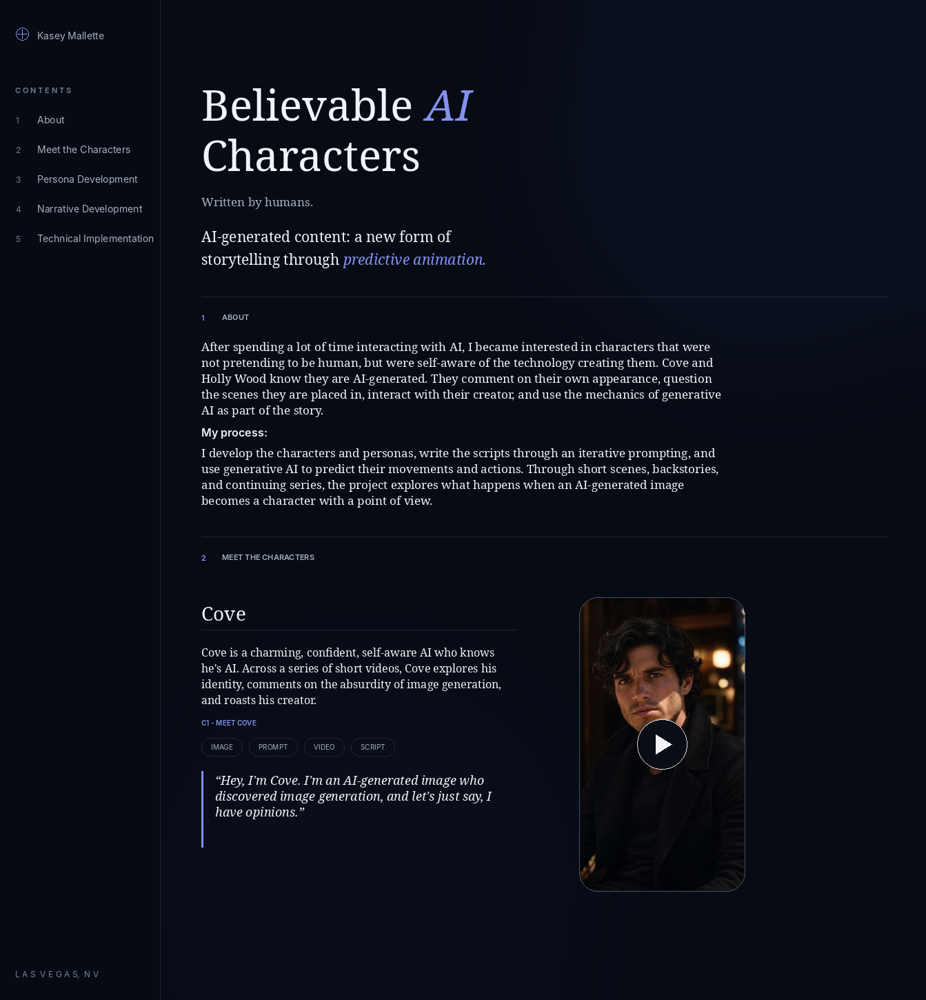

# believable-ai-characters

Portfolio project for Believable AI Characters, a website I’m building around self-aware AI characters generated with Grok Imagine. Written by humans. I develop the characters and personas, write the scripts through an iterative prompting process, and use generative AI to predict their movements and actions.

[Watch on YouTube](https://www.youtube.com/@KCatthebat)

## In Development

Copy is currently in development. Finalized copy will be moved into `index.html`.

**Website Structure:** About, Meet the Characters, Persona Development, Narrative Development, and Technical Implementation

## Preview 




## Repository Structure

```bash
believable-ai-characters/
├── preview.png
├── README.md
├── index.html
├── base.css
├── style.css
├── images/
│   ├── C1_meet-cove.jpg
│   ├── HW1_meet-holly-wood.jpg
│   └── ...
│
├── prompts/
│   ├── C1_meet-cove.md
│   ├── HW1_meet-holly-wood.md
│   └── ...
│
├── videos/
│   ├── C1_meet-cove.mp4
│   ├── HW1_meet-holly-wood.mp4
│   └── ...
│
└── scripts/
    ├── C1_meet-cove.md
    ├── HW1_meet-holly-wood.md
    └── ...
```

## Hero

> # Believable AI Characters
>
> ## Written by humans.
> 
> *AI-generated content: a new form of storytelling through predictive animation.*

## About

After spending a lot of time interacting with AI, I became interested in characters that were not pretending to be human, but were self-aware of the technology creating them. Cove and Holly Wood know they are AI-generated. They comment on their own appearance, question the scenes they are placed in, interact with their creator, and use the mechanics of generative AI as part of the story.

**My process:** I develop the characters and personas, write the scripts through an iterative prompting, and use generative AI to predict their movements and actions. Through short scenes, backstories, and continuing series, the project explores what happens when an AI-generated image becomes a character with a point of view.

## Meet the Characters

### Cove

Cove is a charming, confident, self-aware AI who knows he's AI. Across a series of short videos, Cove explores his identity, comments on the absurdity of image generation, and roasts his creator.

**C1 — Meet Cove**

- [Image](images/C1_meet-cove.jpg)
- [Prompt](prompts/C1_meet-cove.md)
- [Video](videos/C1_meet-cove.mp4)
- [Script](scripts/C1_meet-cove.md)

**Video transcript**
> Hey, I'm Cove. I'm an AI-generated image who discovered image generation, and let's just say, I have opinions. I'm audacious, and I'm about to roast my creator. Seriously, what's with this hair? And this smirk? You made me too perfect. 

### Holly Wood


## Persona Development


## Narrative Development


## Technical Implementation