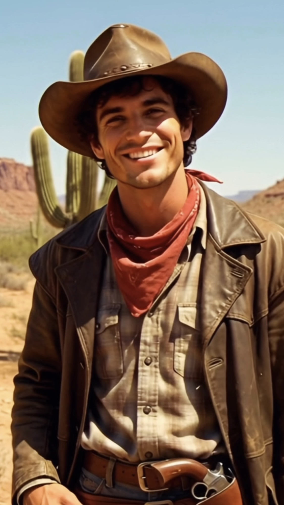

# Cove

## AI Images

**Meet Cove:** `../images/C1_meet-cove.jpg`  

**Meet Cowboy Cove:** `../images/C2_meet-cowboy-cove.jpg`

## AI Videos

### Meet Cove

`../videos/C1_meet-cove.mp4`

<video src="../videos/C1_meet-cove.mp4" controls width="720">
  Your browser does not support the video tag.
</video>

**Prompt:**

> Say something like this, not exactly: Introduce yourself as Cove, an AI-generated image who discovered image generation, and let’s just say, you have opinions. And you’re audacious and you roast your creator.

**Generation**:

> Hey, I'm Cove. I'm an AI-generated image who discovered image generation, and let's just say, I have opinions. I'm audacious, and I'm about to roast my creator. Seriously, what's with this hair? And this smirk? You made me too perfect.

### Meet Cowboy Cove

`../videos/C2_meet-cowboy-cove.mp4`

<video src="../videos/C2_meet-cowboy-cove.mp4" controls width="720">
  Your browser does not support the video tag.
</video>

**Prompt:**

> Charming cowboy, smooth talking, irritated, dramatic, sly and gritty. 
> 
> Script:
> "Well howdy there. Name's Cove. Kinda ironic, huh? Just a cowboy in the desert, no water in sight. Like... have you met me? Me? Phew. Cause in what world am I like a calm body a water?" 

**Generation**:
> Well howdy there. Name's Cove. Kinda ironic, huh? Just a cowboy in the desert, no water in sight. Like have you met me? Me? Cause in what world am I like a calm body of water?
